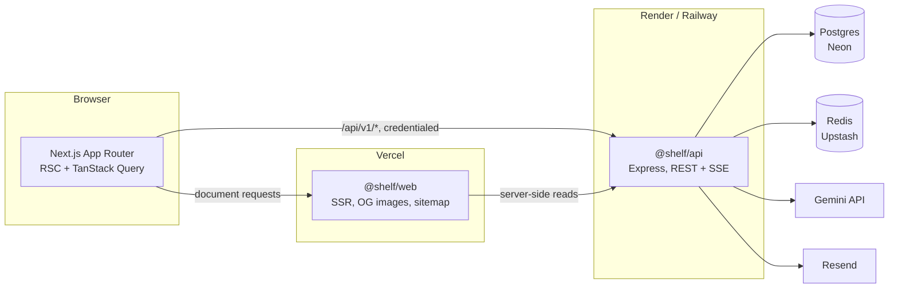

# Shelf

A library for prompts you reuse. Write them, version them, test them, and keep the ones that work.

Two faces, one codebase:

- **The public shelf** — a browsable, searchable library anyone can read, copy, upvote, and fork.
  Guests can contribute with a small daily credit allowance.
- **Your shelf** — for signed-in users. Private by default, with collections, version history,
  variables, test runs, and version comparison.

> Build status: phase 1 of 9 complete. The monorepo, shared template engine, and design system are
> in place; the database layer, API surface, and application UI land in the phases listed in
> [Roadmap](#roadmap).

## Why

Most prompt "managers" are either a notes app with syntax highlighting or a chat window with a save
button. Neither treats a prompt as what it is: a small program with inputs, revisions, and a test
suite. Shelf treats the prompt body as source, `{{variables}}` as its signature, every save as a
commit, and a model call as a test run.

## Architecture



```
shelf/
  apps/
    web/          Next.js App Router, Tailwind v4, CodeMirror 6
    api/          Express, REST + SSE, owns every secret
  packages/
    shared/       template parser, scoring, DTO schemas, constants
    db/           Drizzle schema, migrations, seed          (phase 2)
    config/       tsconfig / ESLint / Prettier / Tailwind theme / brand
  docker-compose.yml
  .github/workflows/ci.yml
```

### Why a separate Express service

Next.js route handlers could serve this API. Express is a deliberate choice, with a real cost:

- **Secret isolation.** The Gemini key, session secret, and credit ledger live in one process that
  has no rendering responsibilities and no client bundle.
- **Long-lived SSE.** Streaming a test run can outlast a serverless invocation budget. A persistent
  Node process does not have that ceiling.
- **A second consumer.** A CLI or browser extension can use the same REST surface without going
  through a rendering layer.

The cost: two deploy targets, two cold starts, and CORS plus cookie scoping to get right. For a
single-surface product this would be over-engineering; it is justified here by the streaming and
secret-isolation requirements.

### Cookies across two origins

In production the browser calls the API origin directly (`api.<domain>`) rather than through a
Next.js rewrite. Rewriting `/api/*` through the web host would be simpler, but it would reintroduce
the platform proxy response timeout on exactly the SSE streams the separate service exists to
support. Instead:

- the session cookie is scoped to the parent domain, so both origins send it;
- `SameSite=Lax` still holds, because sibling subdomains are same-site;
- CORS uses an explicit origin allowlist with `credentials: true`;
- state-changing routes additionally require a double-submit CSRF token.

In development there is no proxy in front of the API, so `next.config.ts` rewrites `/api/*` to
`localhost:4000` and the cookie stays host-only. Nothing in application code branches on this.

## Prompt templates

The template grammar is the one piece of logic both apps depend on, so it lives in
`@shelf/shared` with no dependencies.

```
variable := "{{" name [ ":" default ] "}}"
name     := [A-Za-z_][A-Za-z0-9_-]*      case sensitive, max 64 chars
default  := text up to the first "}}"    surrounding whitespace trimmed
escape   := "\{{" -> "{{"   "\}}" -> "}}"   "\\" -> "\"
```

Decisions worth knowing:

- **Only the first colon splits**, so `{{url:https://example.com:8080/path}}` has the default you
  would expect.
- **Defaults are per variable, not per occurrence.** `{{tone}} … {{tone:direct}}` declares one
  variable defaulting to `direct`; both occurrences render it. A second, different default is
  ignored and reported.
- **A supplied empty string is a value** and overrides the default. Only `undefined` counts as
  unsupplied, so clearing a prefilled field clears the output.
- **Nothing is ever dropped.** Malformed tags stay in the body verbatim and surface as diagnostics
  the editor can underline. Concatenating every token's source range reproduces the input exactly,
  which is asserted as a property over a battery of inputs.

`parseTemplate` returns tokens with source offsets, which is what the CodeMirror highlighter and the
preview renderer both consume — one parser, not two.

## Design system

Tokens live in `packages/config`: `tailwind/theme.css` is the source of truth for the running UI,
`src/theme.ts` mirrors it for `next/og`, which cannot read a stylesheet. `theme.test.ts` fails if
the two drift, and also asserts WCAG AA contrast for every text tone against every surface in both
schemes, so a palette edit cannot quietly break legibility.

Light and dark are a single declaration per token via CSS `light-dark()`. System preference works
with no JavaScript and no flash of the wrong theme; the manual toggle only has to set
`color-scheme` on the root element.

## Running it

Prerequisites: Node >= 20.11, pnpm, Docker.

```bash
pnpm install
docker compose up -d        # Postgres on 5432, Redis on 6379
cp .env.example .env        # every value has a working local default
pnpm db:migrate             # phase 2
pnpm db:seed                # phase 2
pnpm dev                    # web on :3000, api on :4000
```

No Gemini key is required. Without `GEMINI_API_KEY` the API uses `FakeProvider`, and every
model-backed tool still works end to end. Without `RESEND_API_KEY`, verification and reset links are
printed to the API log.

### Tests

```bash
pnpm typecheck
pnpm lint
pnpm test:unit          # Vitest: template parser, scoring, env, app wiring
pnpm test:integration   # Supertest against a real Postgres        (phase 2)
pnpm test:e2e           # Playwright                               (phase 9)
```

### Environment

Every variable is documented with an example in [`.env.example`](.env.example). The API validates
all of them through a Zod schema at boot and refuses to start in production while the development
secrets are still in place.

## Roadmap

| Phase | Scope                                                                 | Status |
| ----- | --------------------------------------------------------------------- | ------ |
| 1     | Monorepo, configs, docker-compose, CI, template parser                | done   |
| 2     | Drizzle schema, migrations, seed, repository layer, `privacy.spec.ts`  | next   |
| 3     | Auth: email/password, Google, sessions, CSRF, verification, reset      |        |
| 4     | Prompts CRUD, versions, diff, restore, fork, votes, reports, credits   |        |
| 5     | Search, trending, public library pages with SSR and OG images          |        |
| 6     | Signed-in shelf UI: sidebar, collections, editor, variables, history   |        |
| 7     | LLM provider layer, test run streaming, compare, tighten, suggestions  |        |
| 8     | Command palette, shortcuts, import/export, dark mode toggle, admin     |        |
| 9     | Full test pass, accessibility audit, security checklist, deploy config |        |

## Known limitations

- **Guest credits are a speed bump, not security.** Identity is a signed cookie plus an HMAC of the
  client IP. Clearing cookies from a new address resets the allowance. Turnstile raises the cost,
  the global daily LLM cap bounds the damage, and neither makes this airtight. Anything that must
  not be abused requires an account.
- **Free tiers sleep.** Render and Neon free instances idle out, so the first request after a quiet
  period can take several seconds.

Further limitations are recorded as the phases that introduce them land.

## License

MIT.
